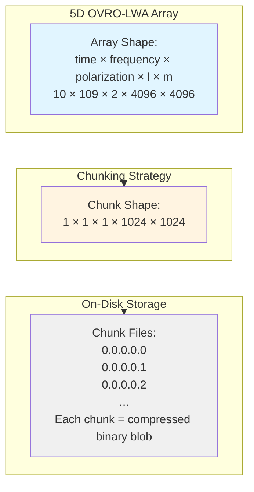

# Zarr Chunking Fundamentals

Understanding how Zarr chunks work is essential for optimizing OVRO-LWA data access on cloud storage. This guide explains the conceptual foundations of chunking and how they apply to radio astronomy workflows.

## What is a Zarr Chunk?

A chunk is the atomic unit of storage and retrieval in Zarr. When you request data from a Zarr array, the entire chunk containing that data must be read, even if you only need a single value. This design trades fine-grained access for efficiency at scale.

Think of a chunk as a contiguous block of array data that is compressed and stored as a single unit. The chunk shape defines how many elements along each dimension are grouped together, while the chunk size (in bytes) determines the actual storage footprint after compression. The total number of chunks in a dataset equals the product of array size divided by chunk size along each dimension.

Each chunk maps to a single file on local storage or a single object in cloud storage like S3 or the Open Storage Network (OSN). The chunk's storage key is simply its position index in the array. For example, the chunk at time index 0, frequency index 1, polarization 0, l-block 0, m-block 0 is stored with the key `0.1.0.0.0`. This design makes it trivial to locate and retrieve any chunk without metadata lookups.

## Chunks and Cloud Object Stores

Cloud object stores like S3 and OSN operate fundamentally differently from traditional filesystems. Each chunk retrieval requires an independent HTTP GET request, and each request carries latency overhead of approximately 50–100 milliseconds regardless of the data size being fetched. This per-request cost dominates performance when working with many small chunks.

To illustrate: fetching 1,000 chunks of 100 KB each requires 1,000 separate HTTP requests, incurring 50–100 seconds of latency overhead alone. If those same chunks were consolidated into 100 chunks of 1 MB each, the latency overhead drops to 5–10 seconds. The network throughput remains the same, but the request overhead shrinks dramatically.

Parallel GET requests provide the primary mechanism for achieving high throughput on cloud storage. Modern Python libraries like `s3fs`, `fsspec`, and `xarray` automatically fetch multiple chunks concurrently, allowing bandwidth to scale with the number of parallel workers. A properly chunked dataset can saturate network bandwidth by fetching dozens of chunks simultaneously, while a poorly chunked dataset wastes time waiting on sequential request latency.

Local storage, by contrast, has negligible per-request latency. Random access to small blocks is cheap on local disk, so chunking matters less for performance and more for compression efficiency and write concurrency. This fundamental difference means that chunk optimization strategies for cloud storage do not necessarily apply to local workflows.

The OVRO-LWA Portal uses the Open Storage Network (OSN) as its S3-compatible backend. OSN provides public datasets via HTTPS URLs and authenticated access via S3 endpoints. When you provide S3 credentials to `open_dataset()`, the library automatically converts OSN HTTPS URLs to S3 endpoints for optimal performance.

## The OVRO-LWA Data Model

OVRO-LWA datasets are stored as 5-dimensional arrays with the following structure:

**Dimensions:**

- **time**: Observation timestamps (Modified Julian Date)
- **frequency**: Radio frequency channels in Hz
- **polarization**: Stokes parameters or linear polarizations (typically 2 values)
- **l**: Direction cosine in the east-west direction (image x-axis)
- **m**: Direction cosine in the north-south direction (image y-axis)

**Data Variables:**

- **SKY** (required): Sky brightness as a function of time, frequency, and position (float32)
- **BEAM** (optional): Instrumental beam pattern (float32)

The spatial grid spans 4096×4096 pixels in the (l, m) plane, providing a wide-field view of the radio sky. At single precision (float32), a single spatial frame occupies 4096 × 4096 × 4 bytes = 67,108,864 bytes ≈ 64 MB uncompressed. With 109 frequency channels and 2 polarizations, a single time snapshot totals approximately 14 GB uncompressed.

<!-- TODO: fill in from research doc dimension sizes table -->

Typical dimension sizes vary by observation:

| Dimension | Typical Size | Range |
|-----------|--------------|-------|
| time | 10–100 | 1–1000 |
| frequency | 109 | Fixed |
| polarization | 2 | Fixed |
| l | 4096 | Fixed |
| m | 4096 | Fixed |

The fixed spatial resolution and frequency channels come from the OVRO-LWA instrument design, while time coverage depends on the observation duration and cadence.

## The Chunk Size Sweet Spot

The industry consensus for cloud-optimized chunking targets 10–100 MB per chunk after compression. This range balances HTTP request overhead with bandwidth efficiency and memory usage.

Below 1 MB, chunks become dominated by network latency rather than transfer time. Fetching 1,000 chunks of 500 KB each on a 100 Mbps connection takes 40 seconds to transfer but incurs 50–100 seconds of pure request overhead. The requests cost more time than the data transfer itself.

Above 500 MB, chunks waste bandwidth when analysis requires only a spatial subset or a single time slice. Reading a 1 GB chunk to extract a 10 MB region transfers 990 MB of unnecessary data. For interactive workflows or selective queries, oversized chunks create unacceptable delays.

Consider a worked example for the OVRO-LWA data model. With a chunk shape of `chunk_lm=1024` on a 4096×4096 spatial grid, the array divides into 4 chunks per spatial dimension, yielding 16 spatial chunks per frame. Each spatial chunk contains 1024 × 1024 × 4 bytes = 4 MB uncompressed. After zstd compression (typical ratio: 3:1 to 5:1 for radio astronomy data), each chunk compresses to approximately 800 KB to 1.3 MB, comfortably within the 10–100 MB target range after accounting for frequency and time chunking.

This chunking strategy aligns with OVRO-LWA's two primary access patterns. For time-frequency extraction targeting a known source position, chunking along spatial dimensions minimizes the number of chunks needed to cover a small region on the sky. The analysis typically averages over frequency channels, so loading a single spatial chunk across all frequencies provides efficient access. For map generation at a selected time or frequency range, chunking along time and frequency dimensions allows selective loading of specific spectral windows without reading the entire dataset. Reading 16 spatial chunks to reconstruct a full 4096×4096 map at a single time-frequency point requires 16 parallel GET requests, completing in approximately the same time as a single request due to parallelization.

Chunk size optimization is not a one-size-fits-all problem. The best chunking strategy depends on your analysis workflow, network bandwidth, and latency constraints. Experimentation with representative queries is essential for production deployments.

## Key Concepts Glossary

**Chunk shape**: The number of array elements included in a single chunk along each dimension. For example, a chunk shape of `(1, 1, 1, 1024, 1024)` includes 1 time sample, 1 frequency channel, 1 polarization, and 1024×1024 spatial pixels.

**Chunk size**: The storage size of a single chunk in bytes, typically measured after compression. A chunk with shape `(1, 1, 1, 1024, 1024)` at float32 precision occupies 4 MB uncompressed and approximately 1 MB after zstd compression.

**Compression ratio**: The factor by which data is reduced during compression. A compression ratio of 4:1 means that 4 MB of uncompressed data compresses to 1 MB. Zarr supports multiple compressors including zstd, blosc, and gzip.

**Consolidated metadata**: A Zarr optimization that stores all chunk metadata in a single `.zmetadata` file rather than individual files per chunk. This reduces the number of HTTP requests required to open a dataset on cloud storage, eliminating metadata-lookup latency.

**Chunk alignment**: The property that data access boundaries align with chunk boundaries. When a query selects data that spans chunk boundaries, multiple chunks must be read. Aligning queries to chunk boundaries minimizes unnecessary data transfer.

**Access pattern**: The typical way that data is queried and subset during analysis. Common OVRO-LWA access patterns include time-series extraction at fixed sky positions, full-map generation at single time-frequency points, and spectral averaging over frequency ranges.

**Dask task graph**: The computational graph generated by dask when operating on chunked arrays. Each chunk becomes a task in the graph, and dask schedules tasks across workers to parallelize computation. Chunk size directly affects task granularity and scheduling overhead.

## External References

- [Zarr Performance User Guide](https://zarr.readthedocs.io/en/stable/user-guide/performance.html) — Official Zarr performance recommendations
- [ESIP Cloud Computing Optimization](https://esipfed.github.io/cloud-computing-cluster/resources-for-optimization.html) — Cloud-optimized data formats for Earth science
- [Xarray Intro to Zarr Tutorial](https://tutorial.xarray.dev/intermediate/intro-to-zarr.html) — Hands-on tutorial for working with Zarr in xarray

## See Also

- [FITS to Zarr Conversion](user-guide/fits-to-zarr.md) — Converting OVRO-LWA FITS files to Zarr format
- [Data Loading API Reference](api/data-loading.md) — API documentation for loading Zarr datasets
