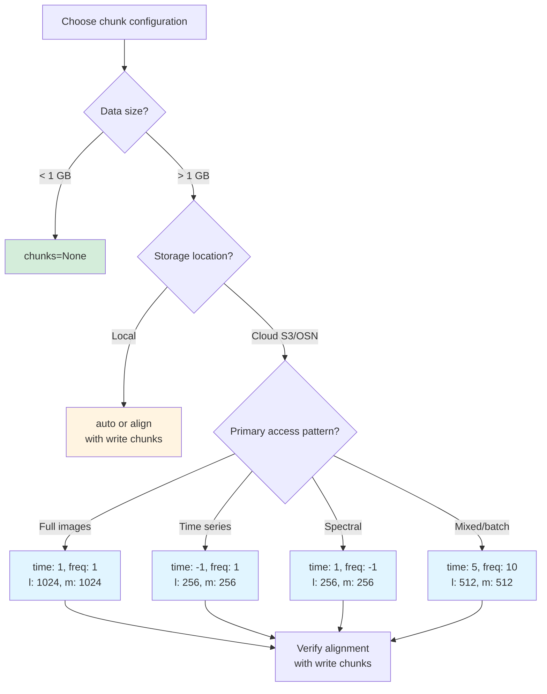

# Read-Time Chunk Optimization

When opening OVRO-LWA datasets with `open_dataset()`, the `chunks` parameter controls how data is divided for lazy loading and parallel processing. Choosing the right chunk configuration for your access pattern can reduce HTTP requests by orders of magnitude and dramatically improve read performance on cloud storage.

This guide explains how read-time chunking works, provides optimized configurations for common analysis workflows, and shows how to align chunks with on-disk layout for maximum efficiency.

## How open_dataset(chunks=...) Works

The `chunks` parameter in `open_dataset()` has three distinct modes that control how xarray and Dask partition your data:

**Mode 1: chunks="auto" (default)**

```python
ds = ovro_lwa_portal.open_dataset("s3://bucket/obs.zarr")  # Uses "auto"
```

The "auto" mode delegates chunk selection to xarray's heuristic, which considers two factors:

1. **Available memory**: Dask estimates available memory per worker and sizes chunks to fit within memory constraints, typically targeting 128 MB per chunk by default
2. **On-disk chunk shape**: xarray reads the Zarr `.zarray` metadata to discover how chunks were written and prefers to align with on-disk boundaries when possible

In practice, "auto" works well for exploratory analysis on moderately-sized datasets, but it doesn't account for your specific access pattern or cloud storage latency characteristics. For production workflows with known query patterns, explicit chunk configuration usually outperforms "auto."

**Mode 2: Explicit dictionary (recommended for cloud)**

```python
ds = ovro_lwa_portal.open_dataset(
    "s3://bucket/obs.zarr",
    chunks={"time": 1, "frequency": 1, "l": 1024, "m": 1024}
)
```

Passing a dictionary specifies the exact chunk size along each dimension. This mode gives you full control and is essential for optimizing cloud access patterns. The chunk shape you specify determines the Dask task graph structure and the number of HTTP requests required for operations.

Use `-1` to load an entire dimension into a single chunk:

```python
chunks={"time": -1, "frequency": 1, "l": 256, "m": 256}  # All times in one chunk
```

**Mode 3: chunks=None (load entire dataset)**

```python
ds = ovro_lwa_portal.open_dataset("local/obs.zarr", chunks=None)
```

Setting `chunks=None` loads the entire dataset into memory as NumPy arrays rather than lazy Dask arrays. Operations execute immediately without task scheduling overhead, but memory usage equals the full dataset size.

**When chunks=None makes sense:**
- Datasets smaller than available RAM (typically < 1 GB)
- Local filesystem access where latency isn't a concern
- Interactive analysis where you'll access most of the data anyway
- Debugging when Dask task graphs complicate troubleshooting

**When to avoid chunks=None:**
- Cloud storage access (would download the entire dataset on open)
- Datasets larger than available memory
- Workflows that only access subsets of the data

For OVRO-LWA datasets, a typical observation with 10 time steps, 48 frequency channels, 1 polarization, and 4096×4096 spatial resolution occupies approximately 30 GB uncompressed. Loading this entirely into memory with `chunks=None` from cloud storage would require downloading all 30 GB before any analysis begins, which is almost never the right choice.

## Access Pattern Recipes

These recipes provide optimized chunk configurations for common OVRO-LWA workflows. Each recipe includes a concrete worked example showing expected HTTP request counts for typical operations.

### Recipe A: Full Spatial Images (Snapshot Analysis)

**Configuration:**
```python
chunks={"time": 1, "frequency": 1, "l": 1024, "m": 1024}
```

**Use case:** Plotting sky maps, spatial statistics, source detection, image-based analysis

**Why these values:**
- Aligns exactly with the default on-disk chunk shape (`chunk_lm=1024` from the write pipeline)
- Minimizes partial chunk reads; each Dask chunk maps to exactly one Zarr chunk on disk
- Loads one complete spatial tile per HTTP request with no wasted bandwidth

**Worked example:**

Assume a dataset written with the default `chunk_lm=1024` on a 4096×4096 spatial grid. The spatial plane divides into a 4×4 grid of 1024×1024 tiles, yielding 16 spatial chunks per time-frequency-polarization point.

Accessing a full spatial map at a single time-frequency point:
```python
ds = ovro_lwa_portal.open_dataset(
    "s3://ovro-lwa/obs.zarr",
    chunks={"time": 1, "frequency": 1, "l": 1024, "m": 1024}
)
sky_map = ds.SKY.isel(time=0, frequency=10).compute()  # 4096×4096 image
```

**HTTP requests:** 16 (one per spatial tile)

Each request fetches exactly one 1024×1024×4-byte chunk = 4 MB uncompressed. With typical astronomical data compression, each request may transfer significantly less than the uncompressed 4 MB chunk. However, the actual compressed size depends on the compressor configuration used by xradio's write_image() and has not been empirically verified for OVRO-LWA data. Use the .zarray inspection method in chunking-write-path.md to check your actual store.

For comparison, using misaligned chunks like `chunks={"time": 1, "frequency": 1, "l": 512, "m": 512}` would require reading the same 16 on-disk chunks but with additional overhead from partial chunk assembly, offering no performance benefit while increasing Dask task graph complexity.

### Recipe B: Time Series at a Point

**Configuration:**
```python
chunks={"time": -1, "frequency": 1, "l": 256, "m": 256}
```

**Use case:** Light curves, transient monitoring, extracting time-frequency evolution at a known source position

**Why these values:**
- `time: -1` loads the entire time axis into a single chunk, enabling efficient time-domain operations
- Small spatial chunks (256×256) minimize wasted bandwidth when accessing a small sky region
- `frequency: 1` allows selective frequency channel access without loading the full spectrum

**Worked example:**

Extracting a time series at a point source location across 10 time steps and 48 frequency channels:

```python
ds = ovro_lwa_portal.open_dataset(
    "s3://ovro-lwa/obs.zarr",
    chunks={"time": -1, "frequency": 1, "l": 256, "m": 256}
)
# Select a 256×256 region around a source
source_data = ds.SKY.sel(l=slice(-0.1, 0.1), m=slice(-0.1, 0.1)).compute()
```

**HTTP requests (for 256×256 region, all times, all frequencies):**

With `chunk_lm=1024` on-disk, a 256×256 region falls entirely within a single on-disk spatial chunk. However, because we're accessing all time steps and all frequency channels:
- 1 spatial chunk position
- 10 time steps
- 48 frequency channels
- **Total: 480 HTTP requests** (1 × 10 × 48)

Each request transfers ~4 MB uncompressed but you only use ~256 KB of each chunk (the 256×256 subregion). Chunk utilization: ~6%. This is the inherent cost of point source access with spatially-oriented chunking.

**Alternative for better efficiency:** If you frequently access point sources, consider rechunking the dataset offline with smaller spatial chunks like `chunk_lm=256` at write time. This would reduce each request's size and improve utilization, though it increases the total chunk count.

### Recipe C: Spectral Analysis

**Configuration:**
```python
chunks={"time": 1, "frequency": -1, "l": 256, "m": 256}
```

**Use case:** Spectral index maps, broadband averaging, radio frequency interference (RFI) flagging, spectral energy distribution (SED) extraction

**Why these values:**
- `frequency: -1` loads all frequency channels for a spatial region in one pass
- Small spatial chunks (256×256) enable efficient processing of spatial tiles without excessive memory
- `time: 1` isolates individual time steps for independent processing

**Worked example:**

Computing a spectral index map for a 512×512 region at a single time step:

```python
ds = ovro_lwa_portal.open_dataset(
    "s3://ovro-lwa/obs.zarr",
    chunks={"time": 1, "frequency": -1, "l": 256, "m": 256}
)
# Select a 512×512 region
region = ds.SKY.isel(time=0).sel(l=slice(-0.2, 0.2), m=slice(-0.2, 0.2))
# All 48 frequencies loaded per spatial chunk
spectral_index = compute_spectral_index(region)  # User-defined function
```

**HTTP requests (for 512×512 region, 1 time, all frequencies):**

A 512×512 region with `chunk_lm=1024` on-disk spans 4 on-disk spatial chunks in a 2×2 grid. With `frequency: -1` read chunking:
- 4 spatial chunk positions (2×2 grid)
- 1 time step
- 1 frequency "chunk" containing all 48 channels (but this must read all 48 on-disk frequency chunks)
- **Total: 192 HTTP requests** (4 spatial × 1 time × 48 frequency)

Each spatial chunk position requires fetching all 48 frequency channels from storage. Dask parallelizes these requests, fetching multiple spatial-frequency combinations concurrently.

### Recipe D: Full Dataset Batch Processing

**Configuration:**
```python
chunks={"time": 5, "frequency": 10, "l": 512, "m": 512}
```

**Use case:** Computing statistics across all dimensions, batch reprocessing, generating summary products, quality metrics

**Why these values:**
- Balanced chunk sizes across all dimensions for mixed access patterns
- `time: 5` and `frequency: 10` group multiple frames for efficient batch operations
- `l: 512, m: 512` is a submultiple of the default `chunk_lm=1024`, maintaining alignment
- Total chunk size: 5 × 10 × 512 × 512 × 4 bytes = 51.2 MB uncompressed per chunk

**Worked example:**

Computing per-pixel RMS across the entire dataset (10 time steps, 48 frequency channels):

```python
ds = ovro_lwa_portal.open_dataset(
    "s3://ovro-lwa/obs.zarr",
    chunks={"time": 5, "frequency": 10, "l": 512, "m": 512}
)
rms_map = ds.SKY.std(dim=["time", "frequency"]).compute()
```

**HTTP requests (full dataset access):**

- Time chunks: ⌈10 / 5⌉ = 2
- Frequency chunks: ⌈48 / 10⌉ = 5
- Spatial l chunks: ⌈4096 / 512⌉ = 8
- Spatial m chunks: ⌈4096 / 512⌉ = 8
- **Total Dask chunks: 2 × 5 × 8 × 8 = 640 chunks**

However, each 512×512 read chunk requires reading four 1024×1024 on-disk chunks (since 512 is half of 1024). The on-disk chunk structure has:
- 10 time steps (chunked as 1 per)
- 48 frequency channels (chunked as 1 per)
- 4×4 spatial chunks of 1024×1024

**Total on-disk chunks: 10 × 48 × 4 × 4 = 7,680 chunks**

With perfect caching and the read chunking specified, Dask would ideally fetch each on-disk chunk once. **Practical HTTP requests: ~7,680** (one per unique on-disk chunk, fetched once and reused across Dask tasks).

This highlights the importance of chunk alignment: the 512×512 read chunks are submultiples of 1024, so each on-disk chunk gets reused efficiently by multiple Dask tasks.

## Chunk Alignment and Partial Reads

Read-time chunks should be multiples or divisors of write-time chunk shapes to avoid inefficient partial chunk reads. When read chunks don't align with on-disk chunks, Zarr must fetch and stitch together multiple on-disk chunks to assemble the requested data, downloading unnecessary bytes.

**The alignment rule:**
```
read_chunk_size % write_chunk_size == 0  OR  write_chunk_size % read_chunk_size == 0
```

For OVRO-LWA data written with the default `chunk_lm=1024`:
- ✅ **Good alignments:** 256, 512, 1024, 2048, 4096 (divisors or multiples of 1024)
- ❌ **Bad alignments:** 500, 750, 1500, 3000 (not evenly divisible)

**Worked example of misalignment:**

Consider reading with `chunks={"l": 512, "m": 512}` from a dataset written with `chunk_lm=1024`:

```
On-disk layout (1024×1024 chunks):
┌─────────┬─────────┬─────────┬─────────┐
│ (0,0)   │ (0,1)   │ (0,2)   │ (0,3)   │
│ 1024×1024│ 1024×1024│ 1024×1024│ 1024×1024│
├─────────┼─────────┼─────────┼─────────┤
│ (1,0)   │ (1,1)   │ (1,2)   │ (1,3)   │
│ ...     │ ...     │ ...     │ ...     │
└─────────┴─────────┴─────────┴─────────┘

Read request for 512×512 region at (0:512, 0:512):
```

This 512×512 region fits entirely within the on-disk chunk `(0,0)`, so only one HTTP request is needed. **This alignment works because 512 divides 1024 evenly.**

Each on-disk 1024×1024 chunk can serve four 512×512 read chunks:
```
┌──────┬──────┐
│ 512  │ 512  │  One 1024×1024 on-disk chunk
├──────┼──────┤  contains four 512×512 regions
│ 512  │ 512  │
└──────┴──────┘
```

**Example of poor alignment:**

Now consider reading with `chunks={"l": 750, "m": 750}`:

```
Read request for 750×750 region at (0:750, 0:750):
```

This 750×750 region partially overlaps the on-disk chunk boundaries. To retrieve it, Zarr must:
1. Fetch chunk `(0,0)`: contributes 750×750 pixels (full coverage)
2. The read chunk is smaller than the on-disk chunk, so only one fetch is needed, but we download 1024×1024 and use only 750×750

Chunk utilization: (750 × 750) / (1024 × 1024) ≈ 53%

**Worse case - non-aligned straddling:**

Reading with `chunks={"l": 1500, "m": 1500}` where the region crosses on-disk boundaries:

```
Read request for 1500×1500 region at (0:1500, 0:1500):

On-disk:              Read chunk spans multiple on-disk chunks:
┌───────┬───────┐     ┌───────────────────┐
│(0,0)  │(0,1)  │     │ 1500×1500 read    │
│1024   │1024   │     │ overlaps four     │
├───────┼───────┤     │ on-disk chunks    │
│(1,0)  │(1,1)  │     └───────────────────┘
└───────┴───────┘
```

To satisfy this read, Zarr must fetch all four on-disk chunks: `(0,0)`, `(0,1)`, `(1,0)`, `(1,1)`. Each is 1024×1024, so we download 4 × (1024×1024) = 4,194,304 pixels to extract 1500×1500 = 2,250,000 pixels.

Chunk utilization: 2,250,000 / 4,194,304 ≈ 54%

**Key takeaway:** Stick to powers of 2 that align with the on-disk `chunk_lm` value (typically 1024). Safe choices for spatial dimensions: 256, 512, 1024, 2048, 4096.

## Practical Decision Guide

**Quick reference for choosing chunks:**

| Your workflow | Recommended configuration | Rationale |
|---------------|--------------------------|-----------|
| Plotting sky maps from cloud | `{"time": 1, "frequency": 1, "l": 1024, "m": 1024}` | Aligns with on-disk chunks, minimal requests |
| Extracting time series (cloud) | `{"time": -1, "frequency": 1, "l": 256, "m": 256}` | Small spatial tiles reduce wasted bandwidth |
| Spectral index mapping (cloud) | `{"time": 1, "frequency": -1, "l": 256, "m": 256}` | All frequencies per spatial region |
| Batch statistics (cloud) | `{"time": 5, "frequency": 10, "l": 512, "m": 512}` | Balanced chunks for mixed access |
| Local filesystem, any workflow | `"auto"` or `{"l": 1024, "m": 1024}` | Local I/O is fast; alignment still helps with memory |
| Small datasets (< 1 GB) | `chunks=None` | Skip Dask overhead, load directly to NumPy |

**Decision flowchart:**



**Common mistakes to avoid:**

- Using `chunks=None` on large cloud datasets (forces complete download)
- Choosing chunk sizes that don't align with on-disk layout (wastes bandwidth)
- Over-chunking time/frequency dimensions (creates excessive Dask tasks)
- Under-chunking spatial dimensions (each chunk too small, too many HTTP requests)

## Verifying Your Configuration

After choosing a chunk configuration, verify it loads correctly and check the resulting Dask task graph:

```python
import ovro_lwa_portal

ds = ovro_lwa_portal.open_dataset(
    "s3://ovro-lwa/obs.zarr",
    chunks={"time": 1, "frequency": 1, "l": 1024, "m": 1024}
)

# Check chunk shape
print(ds.SKY.chunks)
# Output: ((1, 1, 1, ...), (1, 1, 1, ...), (1024, 1024, 1024, 1024), (1024, 1024, 1024, 1024))

# Check total number of chunks
print(f"Total chunks: {ds.SKY.npartitions}")
# For 10 time × 48 freq × 1 pol × (4×4 spatial): 10 × 48 × 1 × 16 = 7,680 chunks
```

If the chunk count seems excessive (> 10,000 for typical workflows), consider consolidating chunks. If chunks are too large (> 500 MB), consider splitting them to improve parallelism.

For cloud access, monitor HTTP request counts during a test `.compute()` call using Dask diagnostics:

```python
from dask.diagnostics import ProgressBar

with ProgressBar():
    result = ds.SKY.isel(time=0, frequency=0).compute()
```

The progress bar shows task execution. Each task typically corresponds to one or more chunk fetches. Comparing task count to expected HTTP requests helps validate your chunking strategy.

## See Also

- [Chunking Fundamentals](chunking-fundamentals.md) - Background on Zarr chunks and the 10-100 MB sweet spot
- [Write Path Pipeline](chunking-write-path.md) - How `chunk_lm` controls on-disk chunk layout
- [Zarr Performance Guide](https://zarr.readthedocs.io/en/stable/user-guide/performance.html) - Official Zarr performance recommendations
- [Xarray Chunking Guide](https://docs.xarray.dev/en/stable/user-guide/dask.html#optimization-tips) - Xarray-specific chunking best practices
