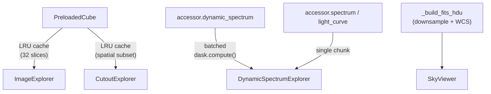

# Interactive Visualization

The `viz` module provides Panel/HoloViews-based interactive explorers for
OVRO-LWA data. Unlike the static matplotlib plots from the `radport` accessor,
these explorers offer real-time slider controls, linked views, and
click-to-inspect interactions — all running in a Jupyter notebook or as a
standalone Panel application.

## Installation

Interactive visualization requires optional dependencies. Install them with:

```bash
pip install 'ovro_lwa_portal[visualization]'
```

Or with pixi:

```bash
pixi install
```

The required packages are **Panel**, **HoloViews**, **Bokeh**, and **Param**.
For the sky viewer, you also need **ipyaladin** and **ipywidgets**.

## Quick Start

```python
import ovro_lwa_portal

ds = ovro_lwa_portal.open_dataset("path/to/data.zarr")

# Launch the full exploration dashboard (all explorers in tabs)
ds.radport.explore()

# Or launch individual explorers
ds.radport.explore_image()
ds.radport.explore_dynamic_spectrum()
ds.radport.explore_sky()  # requires WCS header
```

All explorer methods return Panel layout objects. In Jupyter, they render
inline. For standalone apps, use `panel serve notebook.ipynb`.

## Image Explorer

Browse the full sky image across time, frequency, and polarization with
interactive sliders.

```python
ds.radport.explore_image()
```

**Controls:**

| Control | Description |
|---------|-------------|
| Time Step | Slider to select the time index |
| Frequency Channel | Slider to select the frequency index |
| Colormap | Dropdown with radio-astronomy-friendly colormaps |
| Robust Scaling | Toggle 2nd/98th percentile color clipping |

**Features:**

- Hover to read pixel coordinates and values
- Scroll to zoom, drag to pan
- LRU-cached slices — first view of each (time, freq) pair fetches one chunk
  from storage (~3s for S3), subsequent views are instant

```python
# Access the underlying explorer class directly
from ovro_lwa_portal.viz import ImageExplorer

explorer = ImageExplorer(ds)
explorer.panel()  # Returns the Panel layout
```

## Dynamic Spectrum Explorer

Visualize a time-frequency waterfall at any spatial position, with linked
spectrum and light curve views that update on click.

```python
# At the phase center
ds.radport.explore_dynamic_spectrum()

# At a specific l/m position
ds.radport.explore_dynamic_spectrum(l=0.3, m=-0.1)
```

**Controls:**

| Control | Description |
|---------|-------------|
| l | Direction cosine slider for the spatial position |
| m | Direction cosine slider for the spatial position |
| Colormap | Dropdown colormap selector |
| Robust Scaling | Toggle percentile clipping |

**Linked views:**

- **Click on the waterfall** to show the spectrum at that time step and the
  light curve at that frequency in the right panel

!!! tip "Performance"
    The initial load fetches pixel data across all time/frequency slices using
    the accessor's batched `dask.compute()`. For remote data, this is much
    faster than sequential access. Click-linked views only read one chunk each.

## Cutout Explorer

Interactively explore spatial subregions with adjustable center and extent.

```python
from ovro_lwa_portal.viz import CutoutExplorer

explorer = CutoutExplorer(ds)
explorer.panel()
```

**Controls:**

| Control | Description |
|---------|-------------|
| l center / m center | Spatial center of the cutout |
| dl / dm | Half-extent of the cutout region |
| Time Step | Time index slider |
| Frequency | Frequency channel slider |
| Colormap | Dropdown selector |
| Robust Scaling | Toggle percentile clipping |

**Linked views:**

- Click on the cutout image to get a spectrum and light curve at that pixel

## Sky Viewer

Overlay OVRO-LWA data on astronomical survey backgrounds (DSS, WISE, Planck,
etc.) with real-time panning, zooming, and coordinate grid display. Requires
WCS metadata in the dataset.

```python
ds.radport.explore_sky()
```

!!! warning "Requirements"
    The sky viewer requires a WCS header in the dataset (`fits_wcs_header`
    attribute) and the `ipyaladin` package. It works best in JupyterLab.

**Controls:**

| Control | Description |
|---------|-------------|
| Time Step | Time index for the overlay image |
| Frequency | Frequency channel for the overlay |
| Background Survey | Select from DSS, 2MASS, WISE, Planck, SDSS, etc. |
| Overlay Opacity | Transparency of the OVRO-LWA overlay (0-1) |
| Colormap | Color mapping for the overlay |
| Stretch | Color stretch function (linear, log, sqrt, pow2) |
| Robust Clipping | Toggle percentile clipping |
| Field of View | FOV in degrees (0.1-180) |

**Available survey backgrounds:**

| Name | Description |
|------|-------------|
| DSS Color | Digitized Sky Survey |
| 2MASS Color | Two Micron All Sky Survey |
| AllWISE Color | Wide-field Infrared Survey Explorer |
| Planck HFI Color | Planck High Frequency Instrument |
| SDSS9 Color | Sloan Digital Sky Survey |
| Mellinger Color | Optical all-sky mosaic |
| Fermi Color | Fermi Gamma-ray Space Telescope |
| RASS Soft | ROSAT All-Sky Survey (X-ray) |
| Haslam 408 MHz | 408 MHz all-sky radio survey |

The viewer constructs FITS HDUs from the dataset's numpy arrays and WCS
headers, downsampling large images to 512x512 for overlay performance.

## Exploration Dashboard

Combine all explorers into a single tabbed interface:

```python
ds.radport.explore()
```

This creates a `panel.Tabs` layout with:

1. **Image** — full sky image browser
2. **Dynamic Spectrum** — waterfall with linked views
3. **Cutout** — spatial subregion explorer
4. **Sky Viewer** — Aladin overlay (only if WCS header is available)

## Performance Notes

### Data Access Strategy

Each explorer uses the optimal data access pattern for its use case:



- **ImageExplorer / CutoutExplorer**: Use `PreloadedCube` with stride-based
  downsampling (4096x4096 to 512x512) and an LRU cache of 32 slices. First
  access reads one chunk; repeated access is instant.
- **DynamicSpectrumExplorer**: Uses the accessor's `dynamic_spectrum()` for the
  waterfall (batched `dask.compute()`) and single-frame methods for linked
  views (one chunk read each).
- **SkyViewer**: Builds FITS HDUs with proper WCS, downsampled to 512x512 for
  Aladin overlay performance.

### Display Resolution

All explorers downsample images to a maximum of 512x512 pixels for display.
This keeps interactive controls responsive even with 4096x4096 production data.

### Remote Data

For S3-backed datasets, the dominant cost is chunk I/O. With the default
(4096, 4096) spatial chunks, each single-pixel access reads ~64 MB. The LRU
cache ensures each chunk is read at most once per explorer session.

## Serving as a Web App

Panel explorers can be served as standalone web applications:

```bash
panel serve notebook.ipynb --show --autoreload
```

Or from a Python script:

```python
import panel as pn
import ovro_lwa_portal

ds = ovro_lwa_portal.open_dataset("path/to/data.zarr")

dashboard = ds.radport.explore()
dashboard.servable()
```

## Next Steps

- [Static visualization](visualization.md) — matplotlib-based plots via the
  `radport` accessor
- [Celestial tracking](celestial-tracking.md) — RA/Dec coordinate support
- [API reference](../api/viz-module.md) — full API documentation for the viz
  module
