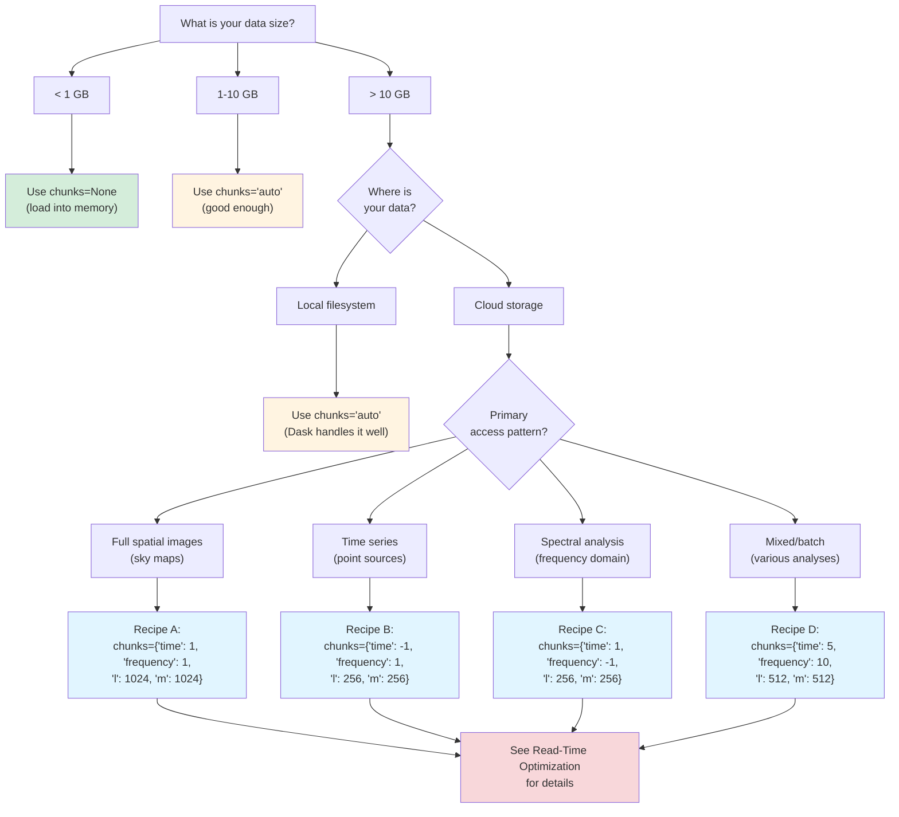

# Chunk Optimization Decision Guide

This quick-reference guide synthesizes the entire Zarr chunk optimization series
into actionable recommendations. Use this as your starting point to choose chunk
configurations, avoid common mistakes, and troubleshoot performance issues.

## Decision Flowchart

Use this flowchart to navigate from your situation to a specific recommendation:



For detailed explanations of each recipe, see
[Read-Time Optimization](chunking-read-optimization.md#access-pattern-recipes).

## Quick Reference Table

Common scenarios with recommended configurations:

| Scenario                              | Write chunk_lm | Read chunks=                                                 | Notes                                        |
| ------------------------------------- | -------------- | ------------------------------------------------------------ | -------------------------------------------- |
| Small local dataset (< 1 GB)          | any            | `None`                                                       | Loads entire dataset to RAM                  |
| Large local dataset (> 10 GB)         | 1024           | `"auto"`                                                     | Dask handles memory automatically            |
| Cloud: spatial analysis               | 1024           | `{"time": 1, "frequency": 1, "l": 1024, "m": 1024}`          | Aligns with write chunks, minimal HTTP       |
| Cloud: time series (point sources)    | 512            | `{"time": -1, "frequency": 1, "l": 256, "m": 256}`           | Small spatial tiles reduce bandwidth waste   |
| Cloud: spectral analysis              | 1024           | `{"time": 1, "frequency": -1, "l": 256, "m": 256}`           | All frequencies per spatial tile             |
| Cloud: batch processing               | 1024           | `{"time": 5, "frequency": 10, "l": 512, "m": 512}`           | Balanced chunks for mixed access             |
| Cloud: exploratory (unknown pattern)  | 1024           | `"auto"`                                                     | Start with auto, optimize after profiling    |
| Local: memory-constrained environment | 512-1024       | Reduce largest dimension (e.g., `{"l": 512, "m": 512}`)      | Trade parallelism for memory footprint       |
| Cloud: high-frequency access          | 1024           | Same as access pattern + `fsspec.simplecache` (see Caching) | Cache frequently accessed chunks             |

**Key principle:** Read chunks should be multiples of write chunks for optimal
alignment. See
[Chunking Fundamentals](chunking-fundamentals.md#chunk-alignment) for why
alignment matters.

## Anti-Patterns (What NOT to Do)

Avoid these common mistakes that degrade performance:

!!! warning "Using chunks=None on Large Remote Datasets"

    **Problem:** Calling `open_dataset("s3://bucket/data.zarr", chunks=None)`
    downloads the entire dataset (potentially 10s of GB) before any analysis
    begins. This causes:

    - Out-of-memory errors on datasets larger than RAM
    - Multi-minute wait times for data transfer
    - Unnecessary egress costs

    **Solution:** Use `chunks="auto"` or explicit chunk dict for datasets > 1 GB
    on cloud storage.

    **Reference:** [Chunking Fundamentals](chunking-fundamentals.md) explains
    when chunks=None is appropriate (small local datasets only).

!!! warning "Very Small Chunks on Cloud Storage"

    **Problem:** Setting chunks < 1 MB (e.g.,
    `chunks={"l": 128, "m": 128}`) creates excessive HTTP requests. With
    ~50-100ms latency per request, a dataset with 100,000 tiny chunks takes
    5,000-10,000 seconds (~2-3 hours) of pure latency overhead.

    **Solution:** Target 10-100 MB compressed chunks. For OVRO-LWA with
    chunk_lm=1024, each spatial tile is ~4 MB uncompressed, which compresses to
    ~1-2 MB typically.

    **Reference:**
    [Chunking Fundamentals](chunking-fundamentals.md#the-10-100-mb-sweet-spot)
    explains the latency-throughput tradeoff.

!!! warning "Misaligned Read Chunks"

    **Problem:** Reading `chunks={"l": 750, "m": 750}` from data written with
    `chunk_lm=1024` forces Zarr to fetch full 1024×1024 on-disk chunks but use
    only part of each, wasting bandwidth. Chunk utilization drops below 50%.

    **Solution:** Use read chunks that are divisors or multiples of write
    chunks: 256, 512, 1024, 2048, 4096 for spatial dimensions.

    **Reference:**
    [Read-Time Optimization](chunking-read-optimization.md#chunk-alignment-and-partial-reads)
    shows worked examples of good and bad alignment.

!!! warning "No Consolidated Metadata on Remote Stores"

    **Problem:** Opening a Zarr store without `.zmetadata` requires N+1 small
    HTTP requests (one per array + attributes). A store with 10 arrays takes
    20+ requests = 1-2 seconds of overhead before any data is read.

    **Solution:** Always create consolidated metadata with
    `zarr.consolidate_metadata("store.zarr")` before deploying stores for
    production use.

    **Reference:**
    [Cloud Storage Configuration](chunking-cloud-storage.md#consolidated-metadata)
    explains how to check for and create consolidated metadata.

!!! warning "Too Many Dask Tasks from Tiny Chunks"

    **Problem:** Chunks that are too small create > 100,000 Dask tasks, causing
    scheduler overhead to dominate execution time. Symptoms: Dask dashboard
    shows tasks queued for minutes, actual computation is fast once started.

    **Solution:** Increase chunk sizes to consolidate tasks. Check task count
    with `len(ds.SKY.data.__dask_graph__())` and target 1,000-10,000 tasks for
    typical operations.

    **Reference:**
    [Benchmarking Performance](chunking-benchmarking.md#dask-task-count)
    explains how to measure and interpret task counts.

!!! warning "Changing chunk_lm Between Ingest Append Operations"

    **Problem:** The OVRO-LWA ingest pipeline's append mode rewrites the entire
    store. Changing chunk_lm between appends creates inconsistent chunk
    boundaries, breaking chunk alignment assumptions.

    **Solution:** Set chunk_lm once at first ingest and keep it consistent for
    all subsequent appends to the same store.

    **Reference:**
    [Write Path Pipeline](chunking-write-path.md#append-mode-behavior) explains
    how append mode handles chunk boundaries.

## Troubleshooting FAQ

### My cloud reads are slow. What should I check?

**Diagnostic steps in order:**

1. **Check chunk sizes**

   ```python
   import ovro_lwa_portal
   ds = ovro_lwa_portal.open_dataset("s3://bucket/data.zarr")
   print(ds.SKY.chunks)
   ```

   Are read chunks < 1 MB uncompressed? If so, they're likely too small for
   cloud access.

2. **Check chunk alignment**

   ```python
   # Compare on-disk chunk shape to read-time chunks
   import zarr
   store = zarr.open("s3://bucket/data.zarr", mode="r", storage_options={...})
   print("On-disk chunks:", store.SKY.chunks)
   print("Read chunks:", ds.SKY.chunks)
   ```

   Do read chunks evenly divide or multiply write chunks? If not, you're
   fetching more data than needed.

3. **Check consolidated metadata**

   ```python
   import zarr
   store = zarr.open("s3://bucket/data.zarr", mode="r", storage_options={...})
   print(".zmetadata exists:", ".zmetadata" in store.store)
   ```

   If False, opening the store requires dozens of small metadata requests.
   Create consolidated metadata with `zarr.consolidate_metadata("store.zarr")`.

4. **Check network latency**

   ```bash
   ping -c 10 caltech1.osn.mghpcc.org
   ```

   Average latency > 200ms suggests network issues or poor routing to the
   endpoint.

5. **Check compression and actual chunk sizes**

   ```bash
   # Inspect on-disk chunk metadata
   python -c "import json; print(json.load(open('store.zarr/SKY/.zarray')))"
   ```

   Look at `compressor` and `chunks` fields. If chunks are < 1 MB after
   compression, they may be too small.

6. **Try caching for repeated access**

   ```python
   import fsspec
   fs = fsspec.filesystem(
       "simplecache",
       target_protocol="s3",
       target_options={"key": "...", "secret": "..."},
       cache_storage="/tmp/zarr_cache"
   )
   mapper = fs.get_mapper("bucket/data.zarr")
   import xarray as xr
   ds = xr.open_zarr(mapper)
   ```

   If the second access is much faster, caching helps. See
   [Cloud Storage Configuration](chunking-cloud-storage.md#caching-strategies)
   for caching options.

**References:**

- [Benchmarking Performance](chunking-benchmarking.md) for systematic
  performance measurement
- [Cloud Storage Configuration](chunking-cloud-storage.md#troubleshooting-cloud-access)
  for cloud-specific troubleshooting

### I'm running out of memory. How do I reduce memory usage?

**Solutions in order of preference:**

1. **Reduce chunk sizes in the largest dimensions**

   ```python
   # If spatial dimensions are large, reduce them
   ds = ovro_lwa_portal.open_dataset(
       "data.zarr",
       chunks={"time": 1, "frequency": 1, "l": 512, "m": 512}  # was 1024
   )
   ```

   Smaller chunks mean less memory per task, but more tasks overall. Find the
   balance.

2. **Process in smaller batches with explicit .compute() calls**

   ```python
   # Instead of:
   result = ds.SKY.mean(dim="time").compute()  # loads all times at once

   # Do this:
   results = []
   for t in range(0, len(ds.time), 5):  # process 5 time steps at a time
       batch = ds.SKY.isel(time=slice(t, t+5)).mean(dim="time").compute()
       results.append(batch)
   result = xr.concat(results, dim="time").mean(dim="time")
   ```

3. **Use Dask distributed scheduler for larger-than-memory processing**

   ```python
   from dask.distributed import Client
   client = Client(n_workers=4, threads_per_worker=1, memory_limit="2GB")
   # Now .compute() uses distributed workers with explicit memory limits
   result = ds.SKY.mean(dim="time").compute()
   ```

4. **Avoid chunks=None on large datasets**

   Never use `chunks=None` if the dataset is larger than available RAM. Always
   use chunked loading with Dask for large datasets.

**Reference:**
[Read-Time Optimization](chunking-read-optimization.md#how-open_datasetchunks-works)
explains the memory implications of different chunk modes.

### Dask is creating too many tasks and the scheduler is slow. How do I fix this?

**Problem:** Task count > 100,000 causes scheduler overhead to dominate.

**Solutions:**

1. **Increase chunk sizes (fewer, larger chunks)**

   ```python
   # Check current task count
   print(len(ds.SKY.data.__dask_graph__()))

   # Increase chunk sizes
   ds = ds.chunk({"l": 2048, "m": 2048})  # was 1024
   print(len(ds.SKY.data.__dask_graph__()))  # should be 4× fewer
   ```

2. **Use `.chunk()` to consolidate existing chunks**

   ```python
   # If you've already opened with small chunks, rechunk in memory
   ds = ds.chunk({"time": 10, "frequency": 10})  # consolidate time/freq
   ```

3. **Avoid operations that expand the task graph unnecessarily**

   Some operations create intermediate tasks. Use built-in reductions when
   possible:

   ```python
   # Efficient: built-in reduction
   result = ds.SKY.mean(dim=["l", "m"]).compute()

   # Inefficient: manual iteration creates many intermediate tasks
   result = sum(ds.SKY.isel(l=i, m=j) for i in range(...) for j in range(...))
   ```

**Target:** Aim for 1,000-10,000 tasks for typical operations. Fewer than 100
limits parallelism; more than 100,000 creates scheduling overhead.

**Reference:**
[Benchmarking Performance](chunking-benchmarking.md#dask-task-count) explains
how task count affects performance.

### How do I rechunk an existing Zarr store?

**Two approaches depending on your needs:**

**Option 1: Simple rechunking with xarray (for small-medium datasets)**

```python
import ovro_lwa_portal
import xarray as xr

# Load with new chunk configuration
ds = ovro_lwa_portal.open_dataset("old_store.zarr", chunks={
    "time": 1, "frequency": 1, "l": 512, "m": 512
})

# Write to new store with new chunks
ds.to_zarr("new_store.zarr", mode="w")
```

**Pros:** Simple, one command
**Cons:** Loads entire dataset into memory (in chunks), slow for large data

**Option 2: Efficient out-of-core rechunking with rechunker (for large
datasets)**

```python
from rechunker import rechunk
import zarr

source = zarr.open("old_store.zarr", mode="r")
target = zarr.open("new_store.zarr", mode="w")

# Define target chunks
target_chunks = {"time": 1, "frequency": 1, "l": 512, "m": 512}

rechunk_plan = rechunk(
    source,
    target_chunks=target_chunks,
    max_mem="2GB",  # memory limit for intermediate storage
    target_store=target,
    temp_store="temp_rechunk.zarr"  # temporary intermediate store
)

rechunk_plan.execute()
```

**Pros:** Efficient for datasets larger than memory, optimized algorithm
**Cons:** Requires additional dependency (`pip install rechunker`)

**When to rechunk vs. when to tune read-time chunks:**

- **Rechunk the store** when you need to change on-disk chunk layout
  permanently for all users (e.g., preparing data for public release)
- **Tune read-time chunks** when you want to optimize for your specific access
  pattern without modifying the source data (recommended for most users)

**References:**

- [Write Path Pipeline](chunking-write-path.md) for how write-time chunks are
  created
- [Read-Time Optimization](chunking-read-optimization.md) for tuning read
  chunks without rechunking

## Documentation Cross-Reference

Each document in the Zarr optimization series covers a specific aspect:

- **[Chunking Fundamentals](chunking-fundamentals.md)** — Conceptual
  foundations: what chunks are, how they map to cloud objects, the 10-100 MB
  sweet spot, and why chunk size matters for cloud performance. Start here if
  you're new to Zarr or cloud-native data.

- **[Write Path Pipeline](chunking-write-path.md)** — How the OVRO-LWA ingest
  pipeline creates chunks during FITS-to-Zarr conversion, the `chunk_lm`
  parameter, what happens in append mode, and how to inspect on-disk chunk
  metadata. Read this if you're running the ingest pipeline or debugging
  write-time chunk issues.

- **[Read-Time Optimization](chunking-read-optimization.md)** — Choosing the
  right `chunks=` parameter for your workflow, four access pattern recipes with
  worked examples (spatial, time-series, spectral, batch), chunk alignment
  principles, and Dask monitoring. The most immediately actionable guide for
  researchers.

- **[Compression Strategies](chunking-compression.md)** — Codec selection
  (Blosc, Zstd, LZ4), how compression interacts with chunk sizes, configuring
  compression via xarray encoding, `write_empty_chunks` for sparse data, and
  compression ratio expectations. Read this when setting up the write pipeline
  or optimizing storage costs.

- **[Benchmarking Performance](chunking-benchmarking.md)** — Systematic
  methodology for measuring chunk performance, key metrics (wall-clock time,
  HTTP requests, throughput, task count), benchmarking script template, using
  Dask diagnostics, and interpreting results. Essential for performance-
  conscious users and when optimizing isn't intuitive.

- **[Cloud Storage Configuration](chunking-cloud-storage.md)** — How fsspec
  works, consolidated metadata setup, provider-specific configuration (S3, GCS,
  OSN), caching strategies (simplecache, filecache, local download), concurrent
  access tuning, cost considerations, and troubleshooting cloud errors. Read
  this when setting up cloud access or debugging remote storage issues.

## One-Page Cheat Sheet

Condensed reference for quick lookup:

### Key Numbers

- **Chunk size sweet spot:** 10-100 MB compressed per chunk
- **Cloud latency:** ~50-100ms per HTTP GET request
- **Default write config:** `chunk_lm=1024` (4 MB uncompressed per spatial
  tile)
- **Default read config:** `chunks="auto"` (Dask/xarray decide)
- **Task count target:** 1,000-10,000 tasks per operation

### Default Configuration

**Write time (ingest):**

```bash
# CLI
ovro-lwa-ingest fits-to-zarr --chunk-lm 1024 input.fits output.zarr

# Python API
from ovro_lwa_portal.ingest import FITSToZarrConverter
converter = FITSToZarrConverter(chunk_lm=1024)
converter.convert("input.fits", "output.zarr")
```

**Read time (analysis):**

```python
import ovro_lwa_portal

# Default: auto chunking
ds = ovro_lwa_portal.open_dataset("data.zarr")

# Cloud-optimized: explicit alignment
ds = ovro_lwa_portal.open_dataset(
    "s3://bucket/data.zarr",
    chunks={"time": 1, "frequency": 1, "l": 1024, "m": 1024},
    storage_options={"key": "...", "secret": "..."}
)
```

### Cloud Essentials Checklist

1. **Consolidated metadata:** Verify `.zmetadata` exists, create with
   `zarr.consolidate_metadata("store.zarr")` if missing
2. **Aligned chunks:** Read chunks should be divisors/multiples of write chunks
   (256, 512, 1024, 2048)
3. **Caching:** Use `fsspec.simplecache` for repeated access to the same
   chunks
4. **Credentials:** Set `storage_options={"key": "...", "secret": "..."}` for
   S3/OSN

### Debug Commands

**Inspect chunk configuration:**

```python
# Read-time chunks (what Dask uses)
ds.SKY.chunks
# Returns: ((1, 1, 1, ...), (1, 1, 1, ...), (1024, 1024, ...), (1024, 1024, ...))

# Number of chunks per dimension
ds.SKY.data.numblocks
# Returns: (10, 48, 1, 4, 4) for 10 time × 48 freq × 1 pol × 4×4 spatial tiles
```

**Count Dask tasks:**

```python
# Total tasks in computation graph
len(ds.SKY.data.__dask_graph__())
# Returns: integer (aim for 1000-10000)

# Tasks for a specific operation
len(ds.SKY.isel(time=0).mean(dim=["l", "m"]).__dask_graph__())
```

**Check on-disk chunk shape:**

```python
# Read .zarray metadata
import json
with open("store.zarr/SKY/.zarray") as f:
    metadata = json.load(f)
print("On-disk chunks:", metadata["chunks"])
print("Compressor:", metadata["compressor"])
```

**Verify consolidated metadata:**

```python
import zarr
store = zarr.open("store.zarr", mode="r")
print(".zmetadata exists:", ".zmetadata" in store.store)
```

### Quick Fixes

| Problem                       | Quick Fix                                                                      |
| ----------------------------- | ------------------------------------------------------------------------------ |
| Slow cloud reads              | Check alignment: `ds.SKY.chunks` vs on-disk chunks                             |
| Out of memory                 | Reduce chunk sizes: `ds.chunk({"l": 512, "m": 512})`                          |
| Too many Dask tasks           | Increase chunk sizes: `ds.chunk({"l": 2048, "m": 2048})`                      |
| Missing consolidated metadata | `zarr.consolidate_metadata("store.zarr")`                                      |
| Can't connect to OSN          | Verify endpoint: `storage_options={"client_kwargs": {"endpoint_url": "..."}}` |

### Access Pattern Quick Reference

| Pattern       | chunks=                                              | Why                         |
| ------------- | ---------------------------------------------------- | --------------------------- |
| Spatial maps  | `{"time": 1, "frequency": 1, "l": 1024, "m": 1024}`  | Aligns with write chunks    |
| Time series   | `{"time": -1, "frequency": 1, "l": 256, "m": 256}`   | Minimize spatial waste      |
| Spectral      | `{"time": 1, "frequency": -1, "l": 256, "m": 256}`   | All frequencies per tile    |
| Batch         | `{"time": 5, "frequency": 10, "l": 512, "m": 512}`   | Balanced general purpose    |
| Small data    | `None`                                               | Load to RAM, skip Dask      |
| Unknown/mixed | `"auto"`                                             | Let Dask decide, profile it |

---

This cheat sheet covers the most common scenarios. For detailed explanations,
refer to the specific documentation pages linked throughout this guide.
