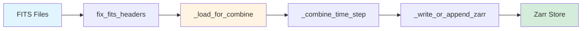

# Write Path Pipeline: Chunking During FITS to Zarr Conversion

When converting OVRO-LWA FITS files to Zarr format, chunking decisions are made
at write time and persist for the lifetime of the dataset. This guide explains
how the ingest pipeline handles chunking, where to configure it, and how to
verify the results.

## The Ingest Pipeline Flow

The FITS to Zarr conversion follows a multi-stage pipeline that processes
observations grouped by time and frequency:



**Pipeline stages:**

1. **fix_fits_headers()**: Normalizes FITS headers to ensure xradio
   compatibility by materializing BSCALE/BZERO scaling and adding required
   keywords.

2. **\_load_for_combine()** (src/ovro_lwa_portal/fits_to_zarr_xradio.py:241):
   Reads individual FITS files, computes RA/Dec coordinates from the WCS, and
   **applies spatial chunking** via `xds.chunk({"l": chunk_lm, "m": chunk_lm})`
   (line 316).

3. **\_combine_time_step()** (line 356): Merges multiple frequency subbands for
   a single time step using `xr.combine_by_coords()`, clearing encoding metadata
   to prevent conflicts (line 416).

4. **\_write_or_append_zarr()** (line 445): Writes the combined dataset to disk
   using xradio's `write_image()` function. For appends, it reads the existing
   store lazily, concatenates along the time dimension, and writes atomically to
   a temporary path before swapping into place.

5. **Zarr Store**: The final Zarr directory contains chunked arrays stored as
   individual compressed blobs, with metadata in `.zarray` and `.zattrs` files.

**Where chunking happens:** The chunking decision is made in
`_load_for_combine()` at line 315–316, where the chunk_lm parameter controls the
spatial tile size. Time, frequency, and polarization dimensions are **not**
explicitly chunked at this stage and inherit defaults from xradio's
`write_image()` behavior.

## The chunk_lm Parameter

The `chunk_lm` parameter controls the chunk size for the **l** and **m** spatial
dimensions, defining the size of spatial tiles that become individual chunks on
disk.

**Default value:** `1024` (creates 1024×1024 spatial tiles)

**Setting via CLI:**

```bash
# Use default chunking (1024×1024)
ovro-ingest convert /path/to/fits /path/to/output

# Custom chunk size (2048×2048 tiles)
ovro-ingest convert /path/to/fits /path/to/output --chunk-lm 2048

# Disable spatial chunking (single chunk per spatial frame)
ovro-ingest convert /path/to/fits /path/to/output --chunk-lm 0
```

**Setting via Python API:**

```python
from pathlib import Path
from ovro_lwa_portal.ingest import FITSToZarrConverter
from ovro_lwa_portal.ingest.core import ConversionConfig

# Default chunking
config = ConversionConfig(
    input_dir=Path("/path/to/fits"),
    output_dir=Path("/path/to/output"),
    zarr_name="observations.zarr",
)

# Custom chunk size
config = ConversionConfig(
    input_dir=Path("/path/to/fits"),
    output_dir=Path("/path/to/output"),
    zarr_name="observations.zarr",
    chunk_lm=2048,  # 2048×2048 spatial tiles
)

# Disable spatial chunking
config = ConversionConfig(
    input_dir=Path("/path/to/fits"),
    output_dir=Path("/path/to/output"),
    zarr_name="observations.zarr",
    chunk_lm=0,  # No spatial chunking
)

converter = FITSToZarrConverter(config)
result = converter.convert()
```

**What chunk_lm=0 does:** Setting `chunk_lm=0` disables spatial chunking
entirely. The conditional check at
src/ovro_lwa_portal/fits_to_zarr_xradio.py:315 skips the `xds.chunk()` call,
leaving spatial dimensions as single monolithic chunks. This configuration is
**not recommended** for cloud storage access, as it forces reading the entire
4096×4096 spatial grid (64 MB uncompressed) even when analyzing a small region.

**Code reference:** The chunk_lm parameter is applied in `_load_for_combine()`:

```python
# src/ovro_lwa_portal/fits_to_zarr_xradio.py:315-316
if chunk_lm and {"l", "m"} <= set(xds.dims):
    xds = xds.chunk({"l": chunk_lm, "m": chunk_lm})
```

This check ensures chunking only applies when both `l` and `m` dimensions exist
in the dataset and `chunk_lm` is non-zero.

## What Happens to Other Dimensions

The OVRO-LWA data model has five dimensions: time, frequency, polarization, l,
and m. The ingest pipeline **only** explicitly chunks the spatial dimensions (l
and m). Time, frequency, and polarization dimensions follow xradio's default
chunking behavior.

**xradio defaults (as of xradio 0.0.37):**

- **time**: Typically chunked with size 1 (one chunk per time step)
- **frequency**: Typically chunked with size 1 (one chunk per frequency channel)
- **polarization**: Typically chunked with size 1 (one chunk per polarization)

These defaults align with the OVRO-LWA workflow, which processes observations as
time-frequency grids. Each (time, frequency, polarization) combination gets its
own set of spatial chunks on disk.

**Implication for chunk layout:** With the default `chunk_lm=1024` on a
4096×4096 spatial grid, each time-frequency-polarization point generates 16
spatial chunks (4×4 tiles). For a typical OVRO-LWA dataset with 10 time steps,
48 frequency channels, and 1 polarization (Stokes I only), the total chunk count
is:

```
10 × 48 × 1 × 16 = 7,680 chunks
```

This granular chunking enables efficient parallel access for both time-series
extraction (reading a fixed spatial position across time and frequency) and map
generation (reading all spatial chunks for a single time-frequency point).

**Encoding metadata clearing:** The pipeline clears encoding metadata at
multiple points (lines 313, 416, 472) to prevent xarray from inheriting
inappropriate chunk shapes or compression settings from intermediate datasets.
The pattern `xds[v].encoding = {}` ensures that xradio's `write_image()`
function applies its own defaults rather than propagating stale metadata.

## Compression at Write Time

The ingest pipeline does **not** currently configure explicit compression
settings. Compression is handled implicitly by xradio's `write_image()`
function, which uses Zarr's default compressor.

**Current state:** The encoding dictionary is explicitly cleared before writing:

```python
# src/ovro_lwa_portal/fits_to_zarr_xradio.py:313
for v in xds.data_vars:
    xds[v].encoding = {}
```

This pattern appears at three locations (lines 313, 416, 472) to ensure clean
encoding metadata throughout the pipeline. Without explicit compression
configuration, Zarr applies its built-in Blosc compressor with default settings.

**What xradio's write_image() does:** Under the hood, `write_image()` delegates
to xarray's `.to_zarr()` method, which creates Zarr arrays with default
compression. The actual compression codec and settings applied by default are
not explicitly documented and may vary. To verify the compression configuration
for your specific dataset, inspect the `.zarray` metadata as described in the
"Inspecting Chunk Metadata" section below.

**How to configure explicit compression:** To control compression settings,
modify the encoding dictionary before the `write_image()` call. Insert this
pattern in `_load_for_combine()` or `_write_or_append_zarr()`:

```python
from numcodecs import Blosc

# Example: Configure zstd compression (level 3) with no shuffle
for v in xds.data_vars:
    xds[v].encoding = {
        "compressor": Blosc(cname="zstd", clevel=3, shuffle=0),
    }

# Alternative: Use lz4 for faster compression/decompression
for v in xds.data_vars:
    xds[v].encoding = {
        "compressor": Blosc(cname="lz4", clevel=5, shuffle=2),
    }
```

Place this configuration **after** the encoding clearing step but **before** the
`write_image()` call. For production deployments, experiment with different
compressors (zstd, lz4, blosclz) and levels to balance compression ratio against
read/write performance.

## Append Mode and Chunk Consistency

The `_write_or_append_zarr()` function supports incremental updates by
concatenating new time steps to an existing Zarr store. This append behavior
enables processing observations in batches without rebuilding the entire
dataset.

**How append works:** When `first_write=False`, the function
(src/ovro_lwa_portal/fits_to_zarr_xradio.py:445):

1. Opens the existing Zarr store lazily with `xr.open_zarr()` (line 469)
2. Clears encoding metadata to prevent conflicts (lines 470–472)
3. Concatenates the existing and new datasets along the time dimension
   (line 481)
4. Writes the combined dataset to a temporary path (line 489)
5. Atomically swaps the temporary store into place (lines 492–494)

This read-concat-rewrite pattern ensures that the source store remains readable
during the append operation, avoiding data loss if the write fails mid-process.

**CRITICAL: Chunk shape consistency**

Zarr requires all chunks along a dimension to have the same shape. If you append
data with a different `chunk_lm` value than the original store, the Zarr
metadata will become inconsistent, **silently corrupting** the chunk layout.

!!! warning "Chunk Size Consistency Required" Always use the **same chunk_lm
value** when appending to an existing store. Changing chunk_lm between appends
will create a malformed Zarr array that may fail to read or return incorrect
data.

**Example of incorrect usage:**

```python
# First conversion with chunk_lm=1024
config1 = ConversionConfig(
    input_dir=Path("/path/to/batch1"),
    output_dir=Path("/path/to/output"),
    zarr_name="observations.zarr",
    chunk_lm=1024,  # 1024×1024 tiles
)
converter1 = FITSToZarrConverter(config1)
converter1.convert()

# WRONG: Appending with different chunk_lm
config2 = ConversionConfig(
    input_dir=Path("/path/to/batch2"),
    output_dir=Path("/path/to/output"),
    zarr_name="observations.zarr",
    chunk_lm=2048,  # ❌ Different chunk size - will corrupt store!
    rebuild=False,
)
converter2 = FITSToZarrConverter(config2)
converter2.convert()  # DANGER: Store now has inconsistent chunks
```

**Correct usage:**

```python
# First conversion with chunk_lm=1024
config1 = ConversionConfig(
    input_dir=Path("/path/to/batch1"),
    output_dir=Path("/path/to/output"),
    zarr_name="observations.zarr",
    chunk_lm=1024,
)
converter1 = FITSToZarrConverter(config1)
converter1.convert()

# Correct: Append with same chunk_lm
config2 = ConversionConfig(
    input_dir=Path("/path/to/batch2"),
    output_dir=Path("/path/to/output"),
    zarr_name="observations.zarr",
    chunk_lm=1024,  # ✓ Same chunk size as original
    rebuild=False,
)
converter2 = FITSToZarrConverter(config2)
converter2.convert()  # Safe: Chunk shapes remain consistent
```

If you need to change chunk_lm, use `rebuild=True` to overwrite the store
completely rather than appending.

## Inspecting Chunk Metadata

After conversion, verify the chunk configuration by inspecting Zarr metadata
files. Each Zarr array has a `.zarray` JSON file containing chunk shape, dtype,
and compressor settings.

**Reading .zarray directly:**

```python
import json
from pathlib import Path

# Path to the Zarr store
store_path = Path("observations.zarr")

# Read metadata for the SKY data variable
meta = json.loads((store_path / "SKY" / ".zarray").read_text())

print(f"Chunk shape: {meta['chunks']}")
print(f"Compressor: {meta['compressor']}")
print(f"Dtype: {meta['dtype']}")
print(f"Array shape: {meta['shape']}")
```

**Example output:**

```
Chunk shape: [1, 1, 1, 1024, 1024]
Compressor: {'id': 'blosc', 'cname': 'lz4', 'clevel': 5, 'shuffle': 1}
Dtype: <f4
Array shape: [10, 48, 2, 4096, 4096]
```

This output confirms that:

- Spatial dimensions (l, m) are chunked as 1024×1024 tiles
- Time, frequency, and polarization have chunk size 1
- Data type is float32 (`<f4`)
- Blosc compressor with lz4 codec is active
- Array has 10 time steps, 48 frequency channels, and 2 polarizations (typical
  OVRO-LWA observations use 1 polarization)

**Programmatic inspection with zarr:**

```python
import zarr

# Open the Zarr store
store = zarr.open("observations.zarr", mode="r")

# Access the SKY array
sky = store["SKY"]

print(f"Chunk shape: {sky.chunks}")
print(f"Compressor: {sky.compressor}")
print(f"Dtype: {sky.dtype}")
print(f"Shape: {sky.shape}")
print(f"Number of chunks: {sky.nchunks}")
```

**Calculating compressed chunk sizes:**

To measure actual storage footprint, inspect the chunk files on disk:

```python
from pathlib import Path

# Path to a specific chunk file (e.g., time=0, freq=0, pol=0, l-tile=0, m-tile=0)
chunk_file = Path("observations.zarr/SKY/0.0.0.0.0")

if chunk_file.exists():
    compressed_size = chunk_file.stat().st_size
    print(f"Compressed chunk size: {compressed_size / 1024:.1f} KB")
else:
    print("Chunk file not found")
```

For cloud storage (S3, OSN), use the storage provider's CLI to inspect object
sizes:

```bash
# AWS S3
aws s3 ls s3://bucket/observations.zarr/SKY/ --recursive --human-readable | head -20

# OSN (via s3cmd)
s3cmd ls s3://bucket/observations.zarr/SKY/ --recursive | head -20
```

**Verifying chunk alignment:** To ensure chunk shapes match your expectations,
compare the `.zarray` metadata across different data variables (SKY, BEAM) and
verify consistency:

```python
import json
from pathlib import Path

store_path = Path("observations.zarr")

for var_name in ["SKY", "BEAM"]:
    var_path = store_path / var_name / ".zarray"
    if var_path.exists():
        meta = json.loads(var_path.read_text())
        print(f"{var_name}: chunks = {meta['chunks']}")
```

All data variables should report identical chunk shapes if they share the same
dimensions. Mismatched chunks indicate a configuration error during conversion.

## See Also

- [Chunking Fundamentals](chunking-fundamentals.md) - Conceptual background on
  Zarr chunks and the 10-100 MB sweet spot
- [FITS to Zarr Conversion](../fits-to-zarr.md) - User guide for the conversion
  CLI and Python API
- [FITS to Zarr API Reference](../../api/fits-to-zarr-xradio.md) - Low-level API
  documentation
